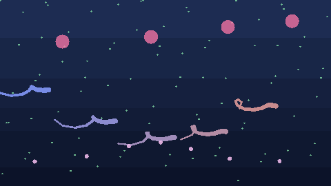

# Evo Lumen Life 🧬🌊

A cross-platform artificial-life sandbox where soft-bodied organisms swim, hunt, reproduce, and evolve in real time.



---

## Why this exists

Most “life sims” either feel too abstract (pure cellular automata) or too rigid (hard generation swaps).

This project aims for something more **alive**:
- continuous overlapping lifecycles,
- visible ecological pressure,
- emergent species behavior,
- and a scene that is fun to watch, not jarring.

---

## What we built

### 1) Continuous ecosystem (no hard generation resets)
Organisms now age, reproduce, and die asynchronously. Population turnover is fluid.

### 2) Reproduction modes
- **Sexual reproduction** (crossover + mutation)
- **Asexual reproduction** (mutated clone/split)
- **Worms lay eggs**; eggs drift, hatch, and hatchlings grow over time

### 3) Trophic dynamics
- Prey forage micro food particles
- Predators chase prey
- Prey flee and use edge refuge behavior under stress
- Predation is gradual (struggle + consumption), not instant binary deletion

### 4) Visual ecology
- Multi-form organisms: worms, flagellates, protozoa, virus-like agents
- Tiny drifting food particles with local fluid disturbance
- Corpses/remains fade instead of hard-disappearing
- Worm swim animation tuned toward lateral tail-swish motion

### 5) Species controls that can evolve with the world
Species list is generated from currently existing lineages. You can pick a species and tune:
- prey drive
- speed
- mobility
- aggression
- sexual attractiveness

As new lineages appear, the list updates.

---

## Run locally

```bash
cd ~/projects/evo-lumen-life
npm install
npm run dev
```

Open the local URL shown by Vite.

---

## Controls

Global:
- Pause / Resume
- Show Champion / Show Ecosystem
- New Genesis
- Export Champion
- Time, Evolution, Drift sliders

Species tuning:
- Select an active species from dropdown
- Adjust prey drive, speed, mobility, aggression, attractiveness
- Changes apply immediately

---

## Tech stack

- TypeScript
- Vite
- Canvas 2D renderer (portable + reliable across Mac/Linux/Windows browsers)

---

## Roadmap ideas

- lineage tree + speciation timeline
- courtship/mate-competition animations
- egg predation and guarding strategies
- camera focus/follow tools for “documentary mode”
- trait persistence and saved worlds

---

## Try it, break it, evolve it

If you like emergent systems, this is your playground.
Fork it, tweak species pressure, and see what kind of life emerges.

If you discover a weird new behavior pattern, open an issue with a clip — those are the best part.
